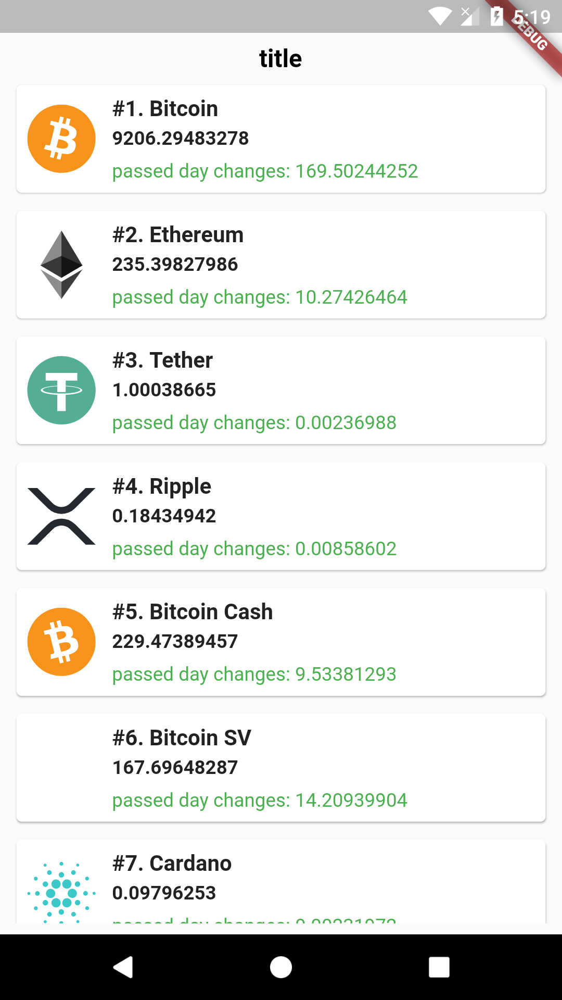

# cryptocurrency

A new Flutter package show crypto currency price list.


## Screenshots



## Usage

[Example](https://github.com/erfanegtfi/cryptocurrency/example/example_app.dart)

To use this package :

* add the dependency to your [pubspec.yaml](ttps://github.com/erfanegtfi/cryptocurrency/pubspec.yaml) file.

```yaml
  dependencies:
    flutter:
      sdk: flutter
    cryptocurrency:
```

### How to use

```dart

class CryptoListWidgett extends StatelessWidget {
  @override
  Widget build(BuildContext context) {
    return new Scaffold(
      body: CryptoListWidget(
        [CryptoCurrencyID.BCH], // choose coin list, set empty array to show all coins
          cryptoCurrencyPriceType: CryptoCurrencyPriceType.USD, // price type USD, EUR, default is USD
          cryptoCurrencyExchange: CryptoCurrencyExchange.binance, // exchange type, default is binance
          header: "title", // list title, don't set to hide
          itemClickCallBack: (Coin coin) { // item click call back
            print("${coin.name} cliced");
          }),
    );
  }
}
```


# License

    Copyright 2020 Erfan Eghterafi

    Licensed under the Apache License, Version 2.0 (the "License");
    you may not use this file except in compliance with the License.
    You may obtain a copy of the License at

       http://www.apache.org/licenses/LICENSE-2.0

    Unless required by applicable law or agreed to in writing, software
    distributed under the License is distributed on an "AS IS" BASIS,
    WITHOUT WARRANTIES OR CONDITIONS OF ANY KIND, either express or implied.
    See the License for the specific language governing permissions and
    limitations under the License.


## Getting Started

For help getting started with Flutter, view our online [documentation](https://flutter.io/).

For help on editing package code, view the [documentation](https://flutter.io/developing-packages/).